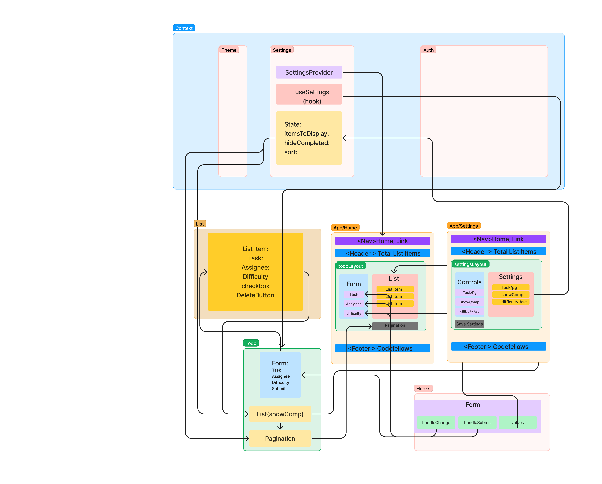

# Todo App

This is a simple Todo application built with React. It allows you to manage a list of tasks and customize various settings related to the app.

## Features

- Add new todo items
- Toggle completion status of todo items
- Delete todo items
- Customize app settings

## Technologies Used

- React
- React Router
- Mantine UI Library

## Installation

1. Clone the repository: `git clone https://github.com/your-username/todo-app.git`
2. Navigate to the project directory: `cd todo-app`
3. Install the dependencies: `npm install`

## Usage

1. Start the development server: `npm start`
2. Open your browser and visit `http://localhost:3000` to access the Todo App.

## Project Structure

- `src/Components/Header.jsx`: Header component for the app.
- `src/Components/Footer.jsx`: Footer component for the app.
- `src/Components/Todo.jsx`: Todo component that manages the list of tasks.
- `src/Components/Settings.jsx`: Settings component for customizing app settings.
- `src/Context/theme.js`: Theme provider for the app.
- `src/Context/Settings.js`: Settings provider for managing app settings.
- `src/App.jsx`: Main entry point of the application.

## UML Diagram

## Contributing

Contributions are welcome! If you find any issues or have suggestions for improvements, please create a new issue or submit a pull request.

## License

This project is licensed under the [MIT License](https://opensource.org/licenses/MIT).
